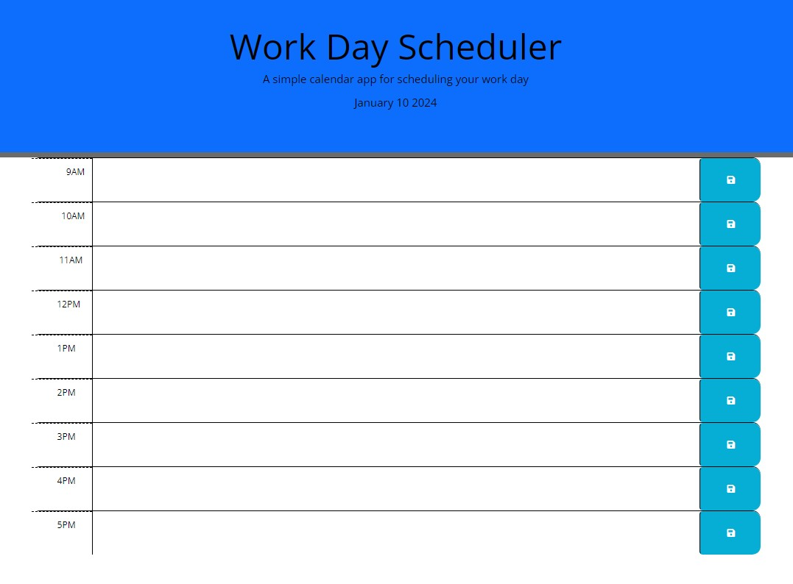

# RC-Daily-Planner

##Description

In this challenge the task was to create a simple calendar application that would show timeblock in a day where users can input data. During the creation process the aim was to make use of skills and knowledge gathered for JavaScript, including jQuery and Day.js library.

##Resources:

The resources used to complete the task:

- The starter code provided by FE Bootcamp team

- https://fontawesome.com/
- https://www.w3schools.com/icons/tryit.asp?filename=tryicons_fa-save
- https://getbootstrap.com/docs/4.0/layout/grid/
- https://www.w3schools.blog/textarea-html
- https://www.javatpoint.com/html-textarea
- https://www.freecodecamp.org/news/javascript-date-time-dayjs/
- https://blog.logrocket.com/localstorage-javascript-complete-guide/#:~:text=Storing%20data%20with%20setItem(),-The%20setItem()&text=The%20key%20can%20be%20referenced,Obaseki%20Nosa%20is%20the%20value.

##Screenshot:

##Licence:

Standard MIT Licence
